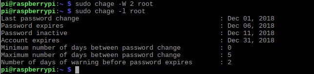

chage command in Linux with examples

The chage command is used to view and change the user password expiry information. This command is used when the login is to be provided for a user for a limited amount of time or when it is necessary to change the login password from time to time. With the help of this command, we can view the ageing information of an account, the date when the password was previously changed, set the password changing time, lock an account after a certain amount of time etc.

The syntax for the chage command is given below :

SYNTAX:

chage [options] LOGIN

In order to view the list of options that can be used with the chage command, use the help option

Input : 
 chage -h 

Output :

 

 Examples:

1. -l option : use this option to view the account aging information. In order to view the aging information of the root i am using the keyword sudo Input : sudo chage -l root

Output :

2. -d option : use this option to set the last password change date to your specified date in the command. In order to change the aging information of the root i am using the keyword “sudo”. Further i am using the -l option to view the changed date. Input : sudo chage -d 2018-12-01 root

Output :

3. -E option : use this option to specify the date when the account should expire. In order to change the aging information of the root i am using the keyword sudo.Further i am using the -l option to view the changed date. Input : sudo chage -E root

Output :

4. -M or -m option : use this option to specify the maximum and minimum number of days between password change. In order to change the aging information of the root i am using the keyword sudo. Further i am using the -l option to view the changed period. Input : sudo chage -M 5 root

Output :

5. -I option : use this option to specify the number of days the account should be inactive after its expiry. It is necessary that the user should change the password after it expires, this command is useful when the user does not login after its expiry. Even after this inactivity period if the password is not changed then the account is locked and the user should approach the admin to unlock it. In order to change the aging information of the root i am using the keyword sudo. Further I used the -l option to view the inactivity period. Input : sudo chage -I 5 root

Output : 

    6. -W option : use this option to give prior warning before the password expires.The input given in the command is the number of days prior to the expiry date when the warning should be given .In order to change the aging information of the root i am using the keyword sudo.Further i am using the -l option to view the warning period. Input : sudo chage -W 2 root

Output :

